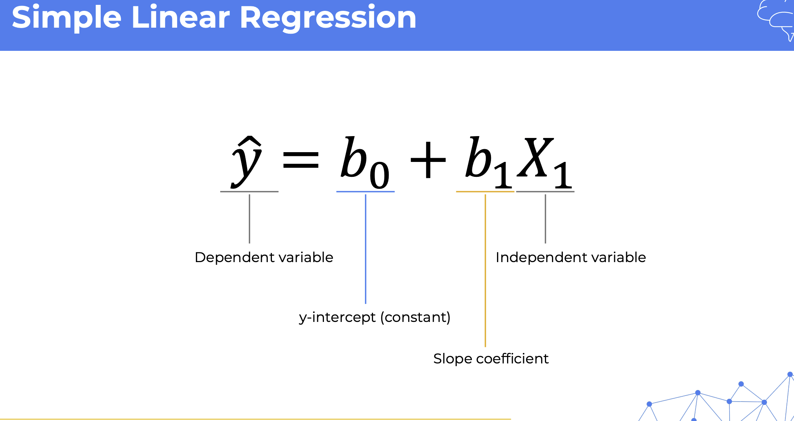
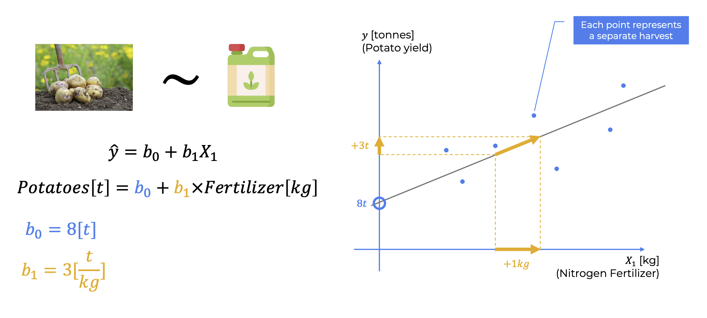
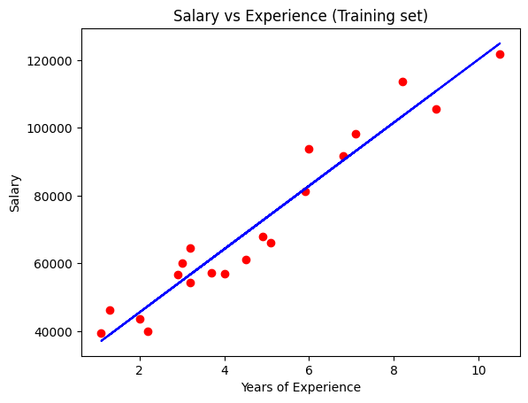
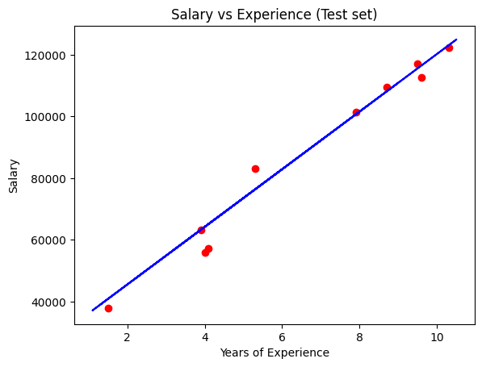

# [AI LEARNING](https://www.superdatascience.com/pages/machine-learning)
Machine Learning A-Z: AI, Python & R + ChatGPT Prize
#### Course Slides & References
[Machine Learning A-Z Course - Downloadable Slides v1.5](https://sds-platform-private.s3-us-east-2.amazonaws.com/uploads/Machine-Learning-A-Z-Course-Downloadable-Slides-V1.5.pdf)
#### Colab Notebooks
[The whole Machine Learning A-Z folder: Code Templates (.ipynb, .py, R), Datasets and Colour Blind Friendly Images](https://sds-platform-private.s3-us-east-2.amazonaws.com/uploads/Machine-Learning-A-Z-Codes-Datasets.zip)

#### Google Drive Codes
[Google Drive codes](https://drive.google.com/drive/folders/1OFNnrHRZPZ3unWdErjLHod8Ibv2FfG1d)

## Section 1: Welcome to the course!

**INFO** : Dataset is which with result that's mean with purchased or not information, other is our data and result is going to be our model.
### What we are going to do  
1. You are a data scientist working for a car company, and you've been given this data set with **ages**, and **estimated salaries** of potential customers. Your task is to predict which ones of these customers are more likely to purchase a car based on a campaign that the sales division will be running.
2. The good news is that the sales division also gave you this data set, which is data from a previous campaign. A very similar campaign they ran in the past, which also has ages and estimated salaries of customers. But it has an additional column, which says whether that customer purchased the car that they were advertised, or whether they didn't purchase a car.
3. So this data set is the one we're going to use to build a model, and then we're going to apply that model to this data set. And we are going to be using a logistic regression model.  
4. We're going to be using Python, and we're going to be working in [Google Co lab](https://colab.research.google.com/).
5. Here we can see the blue dots represent people who purchase. They're usually at a higher age or at a higher salary, and people who didn't purchase are the red dots.  


### Required applications
1. for the make examples you need to install [R](https://cran.r-project.org/) and [R Studio](https://posit.co/download/rstudio-desktop/)
### For install python packages
1. if you have problem as 'numpy doesnt found' you can install like below in the terminal
 ```python -m pip install numpy```
2. if you get error with 'sklearn'
```python -m pip install -U scikit-learn scipy matplotlib```
3. then you just need to click run button


## Section 2: Data Preprocessing
We will start by learning and doing Data Preprocessing in Python

### The machine learning process
when building machine learning models, the process has three main steps.

1. **Data pre-processing**
    * **import the data**
    * **clean the data** : bear in mind that in real-world situations, clean the data is quite an important step.
    * **split the data into training and test sets.**
2. **Modeling**
    * **Build the model**
    * **Train the model**
    * **Make predictions**
3. **Evaluation**
    * **Calculate performance metrics**
    * **Make a verdict**

### Training Set & Test set
 we're talking about the importance of splitting your data set into a training set and a test set.

#### Example
Let's imagine that you are tasked to predict the sale prices of cars, and that is your dependent variable. and your independent variables are the mileage of the car and its age. And in your data that are supplied to you you have 20 cars in total.
of your data out before you do anything.
So what splitting your data implies is separating a part of your data out before you do anything. And usually that's about 20% of the data. So what that means is that the bulk of our data  80% will be our training set and the separated 20% will be our test set.
### Feature Scaling 
* there are multiple types of feature scaling multiple techniques. We're going to look at the two main ones, normalization and standardization.
* please remember that feature scaling is always applied to columns. Feature scaling is never applied across columns, so you wouldn't apply feature scaling to data inside a row.
* With both technics our aims to predict which data is related which.

#### Normalization
* Normalization is the process of taking the minimum inside a column, subtracting that minimum from every single value inside that column, and then dividing by the difference between the maximum and the minimum.
* So basically, every single value in a column is adjusted this way and you will end up with a new column or an adjusted column
with values which are all between 0 and 1.
#### Standardization
* Standardization, on the other hand, the process is similar, but instead of subtracting the minimum, we subtract the average,
and we divide by the standard deviation.
* As a result, all of the values, or almost all of the values inside the column will be between -3 and 3.
#### Example data and result for feature scaling 
* Example data set

* Example data set normalization result

* after scaling it is significant we can group purple and blue person 


## Section 3: Data Preprocessing in Python
in this section we will learn the steps of feature scaling, we will implement all the code in python.
all the examples we are going to make will have same structure like below.

### Importing the libraries
1. **NumPy** will allow us to work with arrays because indeed you will see that your future machinery models will expect some arrays as input, and therefore, we need the library to work with these arrays, and that's NumPy.
2. Then we'll import **matplotlib**, which is the library that will allow us to plot some very nice charts. You will see that we will plot actually many charts and graphs in this course.
3. finally, **pandas**, which Will allow us to not only import the dataset, but also create the matrix of features and the dependent variable vector.

```
import numpy as np
import matplotlib.pyplot as plt
import pandas as pd

```
### Importing the dataset
1. Here we are taking retail company data as example but this code can be changed depends your dataset, here we have 'purchased' column as result, all the columns will be our data processing and matrix data except 'purchased' column because it is result and it will be array.
2. #1_line the problem python will not find this file, you need to give full path.
3. #2_line here iloc is matrix and you give rows and columns cordinates 
    * **'1:3, 1:5'** -> thats mean 1.row till 3.row and 1.column till 5.column
    * **':, :'** -> all rows and columns
    * **':2, :-1'** -> from first rows to second row and all columns except last one.  
    * **':2, -1'** -> from first rows to second row and just last column because there is no range.
there are various approach to seperate data I will inform with future examples
 ```
dataset = pd.read_csv('Data.csv') #1_line
X = dataset.iloc[:, :-1].values #2_line
y = dataset.iloc[:, -1].values
 ```

### Taking care of missing data
we notice that there is a missing salary here for this specific customer from Germany of 40 years old, and who purchased the product.. 
1. in your data set, for the simple reason that it can cause some errors when training your machine learning model, and therefore you must handle them. there are actually several ways to handle them, a first way is to just ignore the observation by deleting it.
2. and now a second way, and this is what we're adding right now in the toolkit, is to actually replace the missing data, you know, the missing value, by the average of all the values in the column, in which the data is missing.
3. explanation of the code
    * #line_1 -> here you import most known library for data processing you can also move that to import library section
    * #line_2 -> here we create new object of imputer and we gave the strategy and say fill the null(nan) values with 'mean'(average of columns)
    * #line_3 -> here basiccaly you gave the cordinates of your rows and columns to imputer basiccaly all the rows and from columns will be in array world -> first and second
    * #line_4 -> here we just replace data in the x matrix with processed one
```
from sklearn.impute import SimpleImputer #line_1
imputer = SimpleImputer(missing_values=np.nan, strategy='mean') #line_2
imputer.fit(X[:, 1:3]) #line_3
X[:, 1:3] = imputer.transform(X[:, 1:3]) #line_4
```
### Encoding categorical data
here we have two places to encode first is independent thats mean the data we are going to process.
and the second one dependent data this is basically result of data.
#### Encoding the Independent Variable
* Let's open the data set again. And as we can see, this data set contains one column with categories, you know, France, Spain, or Germany. First, you might guess that it'll be difficult for machine learning model to compute some correlations between these columns. but we can not give just 0,1 and 2 there should be interpered relations between data.   
* we can do better is actually one hot encoding and one hot encoding consists of turning this country column into three columns.  
* Why three columns?  Because there are actually three different classes in this country column, you know, three different categories. If there were, for example, five countries here, we would turn this column into five columns. And one hot encoding consists of creating binary vectors for each of the countries.  
* So very simply, France would, for example have the vector 1 0 0. Spain would have the vector 0 1 0 and Germany would have the vector 0 0 1.
* Explanation
    * #line_1 -> import ColumnTransformer you can add to import library part
    * #line_2 -> import OneHotEncoder you can add to import library part
    * #line_3 -> first param -> we give encoder as OneHotEncoder and we say encoder transform just first column, you can give label of columns as categorial features ['Country']
    * passthrough -> thats mean dont add remain columns to transformer and encoder, keep others safe
    * then we apply transformed value to X matrix
```
from sklearn.compose import ColumnTransformer #line_1
from sklearn.preprocessing import OneHotEncoder #line_2
ct = ColumnTransformer(transformers=[('encoder', OneHotEncoder(), [0])], remainder='passthrough') #line_3
X = np.array(ct.fit_transform(X)) #line4
```
#### Encoding the Dependent Variable
Here basically we are going to encode Yes and No variables. so that we are going to use LabelEncoder. 
it is single line vector
* here basiccaly we import LabelEncoder and then transform it.
```
from sklearn.preprocessing import LabelEncoder
le = LabelEncoder()
y = le.fit_transform(y)
```
### Splitting the dataset into the Training set and Test set
* Here we are going to split the data set into the training set and the test set.
* Do we have to apply feature scaling before splitting the data set into the training set and test set, or after?
    * There is only one right answer, which is by the way, totally obvious after you get the explanation. So, the answer is we have to apply feature scaling after splitting the data set into the training set and the test set.
```
from sklearn.model_selection import train_test_split
X_train, X_test, y_train, y_test = train_test_split(X, y, test_size = 0.2, random_state = 1)
```
### Feature Scaling
here we are going to use StandardScaler but there are also many different Scalers and for example Normalisation
you can find more information about feature scaling in section 2
```
from sklearn.preprocessing import StandardScaler
sc = StandardScaler()
X_train[:, 3:] = sc.fit_transform(X_train[:, 3:])
X_test[:, 3:] = sc.transform(X_test[:, 3:])
```

### [Coding Exercise 1](https://en.wikipedia.org/wiki/Iris_flower_data_set)
Coding Exercise 1: Importing and Preprocessing a Dataset for Machine Learning, 
1. It is sometimes called Anderson's Iris data set because Edgar Anderson collected the data to quantify the morphologic variation of Iris flowers of three related species.[2] Two of the three species were collected in the Gaspé Peninsula "all from the same pasture, and picked on the same day and measured at the same time by the same person with the same apparatus"
2. The data set consists of 50 samples from each of three species of Iris (Iris setosa, Iris virginica and Iris versicolor). Four features were measured from each sample: the length and the width of the sepals and petals, in centimeters. Based on the combination of these four features, Fisher developed a linear discriminant model to distinguish the species from each other. Fisher's paper was published in the Annals of Eugenics (today the Annals of Human Genetics).[1]

#### Instructions
1. Import the necessary Python libraries: You will need the pandas library for this exercise. Also import numpy and train_test_split from sklearn.model_selection.
2. Load the Iris dataset: The Iris dataset is stored in a CSV file named 'iris.csv'. Use the pandas function read_csv to load this file and store it in a DataFrame. Assign the DataFrame to a variable named dataset.
3. Identify the features and the dependent variable: The features (independent variables) in the Iris dataset are the lengths and widths of the petals and sepals, and the dependent variable is the species of the Iris. The features are stored in all columns except the last one in your DataFrame, and the dependent variable is stored in the last column.
4. Create the matrix of features (X) and the dependent variable vector (y): Use the iloc indexer in pandas to select these subsets of the data and store them in variables X and y respectively. You should use the .values attribute to extract the data as numpy arrays.
5. Print X and y: Finally, print the matrix of features (X) and the dependent variable vector (y) to verify their creation. You can use the print function for this.
#### Solution
```
# Importing the necessary libraries
import pandas as pd
import numpy as np 

# Loading the Iris dataset
dataset = pd.read_csv('iris.csv')


# Creating the matrix of features (X) and the dependent variable vector (y) 
X = dataset.iloc[:, :-1].values 
y = dataset.iloc[:, -1].values

# Printing the matrix of features and the dependent variable vector
print(X)
print(y)
```
### [Coding Exercise 2](https://www.kaggle.com/datasets/uciml/pima-indians-diabetes-database)
Predict the onset of diabetes based on diagnostic measures
#### Instructions
1. Import the necessary Python libraries for data preprocessing, including the `SimpleImputer` class from the scikit-learn library.

2. Load the dataset into a pandas DataFrame using the `read_csv` function from the pandas library. The dataset name is 'pima-indians-diabetes.csv'

3. Identify missing data in your dataset. Print out the number of missing entries in each column. Analyze its potential impact on machine learning model training. This step is crucial as missing data can lead to inaccurate and misleading results.

4. Implement a strategy for handling missing data, which is to replace it with the mean value, based on the nature of your dataset. Other strategies might include dropping the rows or columns with missing data, or replacing the missing data with a median or a constant value.

5. Configure an instance of the `SimpleImputer` class to replace missing values with the mean value of the column.

6. Apply the `fit` method of the `SimpleImputer` class on the numerical columns of your matrix of features.

7. Use the `transform` method of the `SimpleImputer` class to replace missing data in the specified numerical columns.

8. Update the matrix of features by assigning the result of the `transform` method to the correct columns.

9. Print your updated matrix of features to verify the success of the missing data replacement.
#### Solution
```
# Importing the necessary libraries
import pandas as pd
import numpy as np
from sklearn.impute import SimpleImputer

# Load the dataset
df = pd.read_csv('pima-indians-diabetes.csv')

# Identify missing data (assumes that missing data is represented as NaN)
missing_data = df.isnull().sum()

# Print the number of missing entries in each column
print("Missing data: \n", missing_data)

# Configure an instance of the SimpleImputer class
imputer = SimpleImputer(missing_values=np.nan, strategy='mean')

# Fit the imputer on the DataFrame
imputer.fit(df)
# Apply the transform to the DataFrame
df_imputed = imputer.transform(df)
#Print your updated matrix of features
print("Updated matrix of features: \n", df_imputed)
```
### [Coding Exercise 3](https://www.kaggle.com/c/titanic/data)
Start here! Predict survival on the Titanic and get familiar with ML basics
#### Instructions
1. Import required libraries - Pandas, Numpy, and required classes for this task - ColumnTransformer, OneHotEncoder, LabelEncoder.

2. Start by loading the Titanic dataset into a pandas data frame. This can be done using the pd.read_csv function. The dataset's name is 'titanic.csv'.

3. Identify the categorical features in your dataset that need to be encoded. You can store these feature names in a list for easy access later.

4. To apply OneHotEncoding to these categorical features, create an instance of the ColumnTransformer class. Make sure to pass the OneHotEncoder() as an argument along with the list of categorical features.

5. Use the fit_transform method on the instance of ColumnTransformer to apply the OneHotEncoding.

6. The output of the fit_transform method should be converted into a NumPy array for further use.

7. The 'Survived' column in your dataset is the dependent variable. This is a binary categorical variable that should be encoded using LabelEncoder.

8.  Print the updated matrix of features and the dependent variable vector

#### Solution
```
# Importing the necessary libraries
import pandas as pd
import numpy as np
from sklearn.compose import ColumnTransformer
from sklearn.preprocessing import OneHotEncoder, LabelEncoder

# Load the dataset
df = pd.read_csv('titanic.csv')

# Identify the categorical data
categorical_features = ['Sex', 'Embarked', 'Pclass']

# Implement an instance of the ColumnTransformer class
ct = ColumnTransformer(
    transformers=[
        ('encoder', OneHotEncoder(), categorical_features)
    ], remainder='passthrough')


# Apply the fit_transform method on the instance of ColumnTransformer
ft = ct.fit_transform(df)


# Convert the output into a NumPy array
X = np.array(ft)

# Use LabelEncoder to encode binary categorical data
le = LabelEncoder()
y = le.fit_transform(df['Survived'])

# Print the updated matrix of features and the dependent variable vector
print("Updated matrix of features: \n", X)
print("Updated dependent variable vector: \n", y)
```  
### [Coding Exercise 4](https://en.wikipedia.org/wiki/Iris_flower_data_set)  
Same as Exercise 2
#### Instructions
1. Import necessary Python libraries: pandas, train_test_split from sklearn.model_selection, and StandardScaler from sklearn.preprocessing.

2. Load the Iris dataset using Pandas read.csv. Dataset name is iris.csv.
3. Use train_test_split to split the dataset into an 80-20 training-test set.
4. Apply random_state with 42 value in train_test_split function for reproducible results.
5. Print X_train, X_test, Y_train, and Y_test to understand the dataset split.
6. Use StandardScaler to apply feature scaling on the training and test sets.
7. Print scaled training and test sets to verify feature scaling.
#### Solution
```
# Import necessary libraries
import pandas as pd
from sklearn.model_selection import train_test_split
from sklearn.preprocessing import StandardScaler

# Load the Iris dataset
iris_df = pd.read_csv('iris.csv')

# Separate features and target
X = iris_df.drop('target', axis=1)
y = iris_df['target']

# Split the dataset into an 80-20 training-test set
X_train, X_test, y_train, y_test = train_test_split(X, y, test_size=0.2, random_state=42)

# Apply feature scaling on the training and test sets
sc = StandardScaler()
X_train = sc.fit_transform(X_train)
X_test = sc.transform(X_test)

# Print scaled training and test sets
print("Scaled Training Set:")
print(X_train)
print("\nScaled Test Set:")
print(X_test)
```
### [Coding Exercise 5](https://www.kaggle.com/code/nimapourmoradi/red-wine-quality/input)
This datasets is related to red variants of the Portuguese "Vinho Verde" wine. For more details, consult the reference [Cortez et al., 2009]. Due to privacy and logistic issues, only physicochemical (inputs) and sensory (the output) variables are available (e.g. there is no data about grape types, wine brand, wine selling price, etc.).
#### Instructions
1. Import the necessary libraries for data preprocessing, including the StandardScaler and train_test_split classes.
2. Load the "Wine Quality Red" dataset into a pandas DataFrame. You can use the pd.read_csv function for this. Make sure you set the correct delimeter for the file.
3. Split your dataset into an 80-20 training-test set. Set random_state to 42 to ensure reproducible results.
4. Create an instance of the StandardScaler class.
5. Fit the StandardScaler on features from the training set, excluding the target variable 'Quality'.
6. Use the "fit_transform" method of the StandardScaler object on the training dataset.
7. Apply the "transform" method of the StandardScaler object on the test dataset.
8. Print your scaled training and test datasets to verify the feature scaling process.
#### Solution
```
# Import necessary libraries
import pandas as pd
from sklearn.model_selection import train_test_split
from sklearn.preprocessing import StandardScaler

# Load the Wine Quality Red dataset
dataset = pd.read_csv('winequality-red.csv', delimiter=';')

# Separate features and target
X = dataset.drop('quality', axis=1)
y = dataset['quality']

# Split the dataset into an 80-20 training-test set
X_train, X_test, y_train, y_test = train_test_split(X, y, test_size=0.2, random_state=42)

# Create an instance of the StandardScaler class
sc = StandardScaler()


# Fit the StandardScaler on the features from the training set and transform it
X_train = sc.fit_transform(X_train)

# Apply the transform to the test set
X_test = sc.transform(X_test)

# Print the scaled training and test datasets
print(X_train)
print(X_test)
```

## Section 4: Data Preprocessing in R
I will skip this section because I just want to use python 

## Section 5: Regression(Welcome)
Regression models (both linear and non-linear) are used for predicting a real value, like salary for example. If your independent variable is time, then you are forecasting future values, otherwise your model is predicting present but unknown values. Regression technique vary from Linear Regression to SVR and Random Forests Regression.

In this part, you will understand and learn how to implement the following Machine Learning Regression models:

1. Simple Linear Regression

2. Multiple Linear Regression

3. Polynomial Regression

4. Support Vector for Regression (SVR)

5. Decision Tree Regression

6. Random Forest Regression

## Section 6: Simple Linear Regression
### Entrance
*  So here's the equation, and we will look at the parts of this equation one by one. So on the left, we have our dependent variable,  which we're trying to predict.
* On the right, we have our independent variable, which is the predictor. Here we have b0, which is the y-intercept, also known as the constant,  and b1 is the slope coefficient.  

* we are going to use that example we mentioned about **predicting the output of potatoes on a farm**  based on the **amount of fertilizer** that we use.

*  let's say that we ran  the simple linear regression algorithm, and it came up with the following values. B0 equals eight tons, and b1 equals three tons per kilogram.
* B0 equals eight tons,  and b1 equals three tons per kilogram.
* How can we better understand this on an intuitive level?
So let's plot a simple scatter plot. So here we have on the x-axis the nitrogen fertilizer used in kilograms. That's our x1 variable. And here we have the y variable,  which is the potato yield in tons.And here on the scatter plot, we have several data points. 
What are these data points? 
* Well, each one represents a separate harvest  on the farm that we are talking about. So multiple times the potatoes  were harvested over many years, and the farmer recorded how much fertilizer they used and also how many potatoes they were able to harvest.
* if you increase the amount of nitrogen fertilizer  by one kilogram, then the amount of potato output will increase by three tons. And, of course, these numbers are made up for illustrative purposes.
### Ordinary Least Squares
Ordinary Least Squares (OLS) is a method used in statistics and econometrics to estimate the parameters in a linear regression model. In simple terms, it's a way to find the line that best fits a set of data points by minimizing the sum of the squared differences between the observed values and the values predicted by the line.

#### Here's how it works with an example:

Let's say we have a dataset that represents the relationship between the number of hours studied and the score obtained on a test. We want to determine if there's a linear relationship between these two variables and if so, how strong it is.

Here's a small subset of the dataset:

| Hours Studied (X) | Test Score (Y) |
|-------------------|----------------|
|        1          |       60       |
|        2          |       65       |
|        3          |       70       |
|        4          |       75       |
|        5          |       80       |

Now, we want to find the line that best represents the relationship between hours studied (X) and test score (Y). We assume a simple linear relationship of the form:

Y = beta_0 + beta_1 * X

Where:
-  *Y* is the test score,
-  *X* is the hours studied,
-  *beta_0* is the intercept (the value of Y when X is zero),
-  *beta_1* is the slope (how much Y changes for a one-unit change in X).

The goal of OLS is to find the values of *beta_0* and *beta_1* that minimize the sum of the squared differences between ***the observed test scores*** and the ***test scores predicted by the line***.

**For our example**, the OLS method would find the values of **beta_0** and **beta_1** that minimize the sum of the squared differences between the actual test scores and the ones predicted by the line. Once those values are determined, we have our linear regression equation, and we can use it to predict test scores for any given number of hours studied.

In this case, the OLS method would give us the equation of the line, something like:

Test Score= 55 + 5*(Hours Studied)

This equation represents the best fit line through our data points, and we can use it to predict test scores for any number of hours studied within the range of our data.

####  OLS solution step by step
Let's solve the problem step by step using Ordinary Least Squares (OLS) to find the linear regression equation for the relationship between hours studied and test scores.

Step 1: Calculate the means of the hours studied *avr_X* and test scores *avr_Y*.

avr_X = (1 + 2 + 3 + 4 + 5)/(5) = 3

avr_Y = (60 + 65 + 70 + 75 + 80)/(5) = 70

Step 2: Calculate the deviations from the means for both hours studied (X-avr_X) and test scores (Y-avr_Y).

| Hours Studied (X) | Test Score (Y) | ( X - avr_X ) | ( Y - avr_Y ) |
|-------------------|----------------|-------------------|-------------------|
|        1          |       60       |        -2         |       -10         |
|        2          |       65       |        -1         |        -5         |
|        3          |       70       |         0         |         0         |
|        4          |       75       |         1         |         5         |
|        5          |       80       |         2         |        10         |

Step 3: Calculate the squared deviations for both hours studied ( (X - avr_X)^2 ) and test scores ( (Y - avr_Y)^2 ).

| Hours Studied (X) | Test Score (Y) | (X - avr_X)^2 |  (Y - avr_Y)^2  |
|-------------------|----------------|-----------------------|-----------------------|
|        1          |       60       |           4           |          100          |
|        2          |       65       |           1           |           25          |
|        3          |       70       |           0           |            0          |
|        4          |       75       |           1           |           25          |
|        5          |       80       |           4           |          100          |

Step 4: Calculate the product of the deviations for each data point ((X - avr_X)(Y - avr_Y)).

| Hours Studied (X) | Test Score (Y) | (X - avr_X)(Y - avr_Y) |
|-------------------|----------------|----------------------------------|
|        1          |       60       |               20                 |
|        2          |       65       |                5                 |
|        3          |       70       |                0                 |
|        4          |       75       |                5                 |
|        5          |       80       |               20                 |

Step 5: Calculate the slope (beta_1) using the formula:

beta_1 = (sum (X - avr_X)(Y - avr_Y))/(sum (X - avr_X)^2)

beta_1 = (20 + 5 + 0 + 5 + 20)/(4) = (50)/(4) = 12.5

Step 6: Calculate the intercept (beta_0) using the formula:

beta_0 = avr_Y - beta_1 *avr_X 

beta_0 = 70 - 12.5 * 3 = 70 - 37.5 = 32.5

Step 7: Write down the linear regression equation using the calculated values of (beta_0) and (beta_1):

Test Score = 32.5 + 12.5 *(Hours Studied)

So, the linear regression equation for this dataset is:

Test Score = 32.5 + 12.5 *(Hours Studied)

This equation represents the best-fit line through the given data points, allowing us to predict test scores based on the number of hours studied.

#### SLR code example
* You can find the code in [SECTION-6/slr.py](https://github.com/vahapgencdal/AI/blob/main/SECTION-6/slr.py) file
* Visualize results

* and here We can visualize test results

