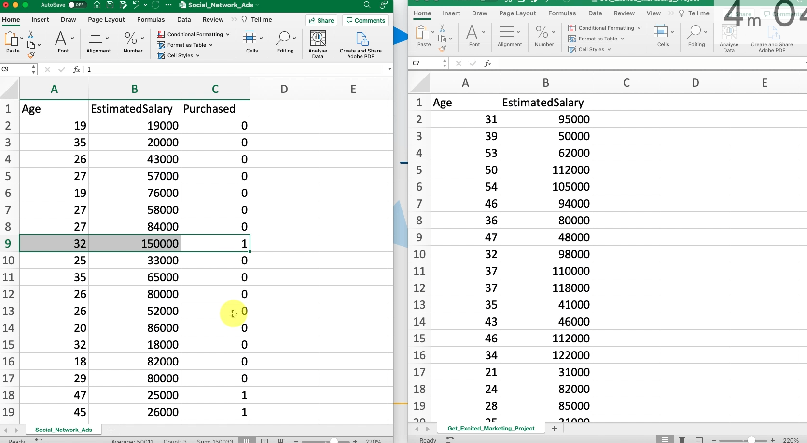
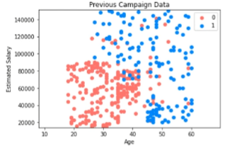

# [AI LEARNING](https://www.superdatascience.com/pages/machine-learning)
Machine Learning A-Z: AI, Python & R + ChatGPT Prize
#### Course Slides & References
[Machine Learning A-Z Course - Downloadable Slides v1.5](https://sds-platform-private.s3-us-east-2.amazonaws.com/uploads/Machine-Learning-A-Z-Course-Downloadable-Slides-V1.5.pdf)
#### Colab Notebooks
[The whole Machine Learning A-Z folder: Code Templates (.ipynb, .py, R), Datasets and Colour Blind Friendly Images](https://sds-platform-private.s3-us-east-2.amazonaws.com/uploads/Machine-Learning-A-Z-Codes-Datasets.zip)

## Section 1: Welcome to the course!

**INFO** : Dataset is which with result that's mean with purchased or not information, other is our data and result is going to be our model.
  
1. You are a data scientist working for a car company, and you've been given this data set with **ages**, and **estimated salaries** of potential customers. Your task is to predict which ones of these customers are more likely to purchase a car based on a campaign that the sales division will be running.
2. The good news is that the sales division also gave you this data set, which is data from a previous campaign. A very similar campaign they ran in the past, which also has ages and estimated salaries of customers. But it has an additional column, which says whether that customer purchased the car that they were advertised, or whether they didn't purchase a car.
3. So this data set is the one we're going to use to build a model, and then we're going to apply that model to this data set. And we are going to be using a logistic regression model.  
4. We're going to be using Python, and we're going to be working in [Google Co lab](https://colab.research.google.com/).
5. Here we can see the blue dots represent people who purchase. They're usually at a higher age or at a higher salary, and people who didn't purchase are the red dots.

