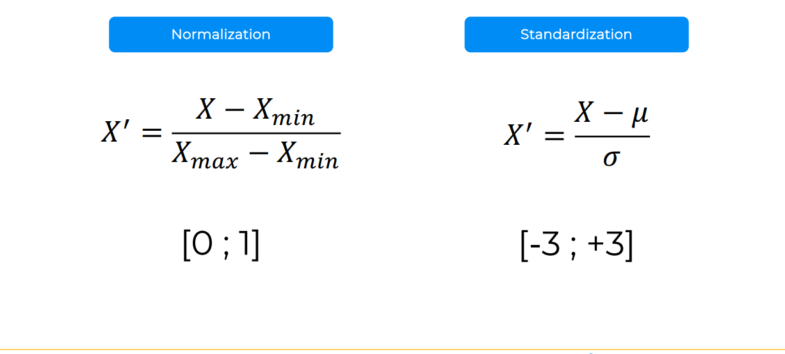
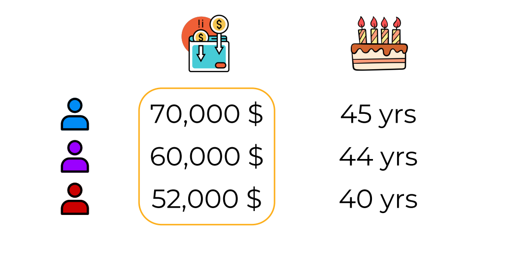
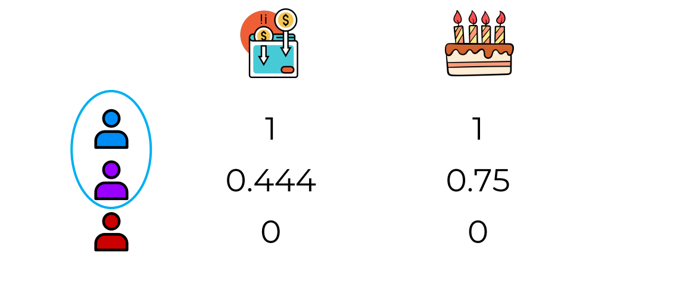
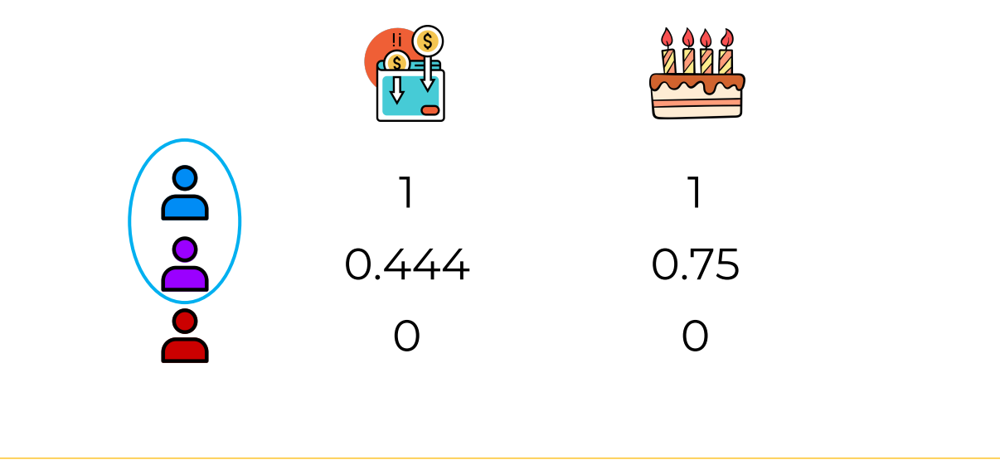

# [AI LEARNING](https://www.superdatascience.com/pages/machine-learning)
Machine Learning A-Z: AI, Python & R + ChatGPT Prize
#### Course Slides & References
[Machine Learning A-Z Course - Downloadable Slides v1.5](https://sds-platform-private.s3-us-east-2.amazonaws.com/uploads/Machine-Learning-A-Z-Course-Downloadable-Slides-V1.5.pdf)
#### Colab Notebooks
[The whole Machine Learning A-Z folder: Code Templates (.ipynb, .py, R), Datasets and Colour Blind Friendly Images](https://sds-platform-private.s3-us-east-2.amazonaws.com/uploads/Machine-Learning-A-Z-Codes-Datasets.zip)

## Section 1: Welcome to the course!

**INFO** : Dataset is which with result that's mean with purchased or not information, other is our data and result is going to be our model.
### What we are going to do  
1. You are a data scientist working for a car company, and you've been given this data set with **ages**, and **estimated salaries** of potential customers. Your task is to predict which ones of these customers are more likely to purchase a car based on a campaign that the sales division will be running.
2. The good news is that the sales division also gave you this data set, which is data from a previous campaign. A very similar campaign they ran in the past, which also has ages and estimated salaries of customers. But it has an additional column, which says whether that customer purchased the car that they were advertised, or whether they didn't purchase a car.
3. So this data set is the one we're going to use to build a model, and then we're going to apply that model to this data set. And we are going to be using a logistic regression model.  
4. We're going to be using Python, and we're going to be working in [Google Co lab](https://colab.research.google.com/).
5. Here we can see the blue dots represent people who purchase. They're usually at a higher age or at a higher salary, and people who didn't purchase are the red dots.  


### Required applications
1. for the make examples you need to install [R](https://cran.r-project.org/) and [R Studio](https://posit.co/download/rstudio-desktop/)
### For install python packages
1. if you have problem as 'numpy doesnt found' you can install like below in the terminal
 ```python -m pip install numpy```
2. if you get error with 'sklearn'
```python -m pip install -U scikit-learn scipy matplotlib```
3. then you just need to click run button


## Section 2: Data Preprocessing
We will start by learning and doing Data Preprocessing in Python

### The machine learning process
when building machine learning models, the process has three main steps.

1. **Data pre-processing**
    * **import the data**
    * **clean the data** : bear in mind that in real-world situations, clean the data is quite an important step.
    * **split the data into training and test sets.**
2. **Modeling**
    * **Build the model**
    * **Train the model**
    * **Make predictions**
3. **Evaluation**
    * **Calculate performance metrics**
    * **Make a verdict**

### Training Set & Test set
 we're talking about the importance of splitting your data set into a training set and a test set.

#### Example
Let's imagine that you are tasked to predict the sale prices of cars, and that is your dependent variable. and your independent variables are the mileage of the car and its age. And in your data that are supplied to you you have 20 cars in total.
of your data out before you do anything.
So what splitting your data implies is separating a part of your data out before you do anything. And usually that's about 20% of the data. So what that means is that the bulk of our data  80% will be our training set and the separated 20% will be our test set.
### Feature Scaling 
* there are multiple types of feature scaling multiple techniques. We're going to look at the two main ones, normalization and standardization.
* please remember that feature scaling is always applied to columns. Feature scaling is never applied across columns, so you wouldn't apply feature scaling to data inside a row.
* With both technics our aims to predict which data is related which.

#### Normalization
* Normalization is the process of taking the minimum inside a column, subtracting that minimum from every single value inside that column, and then dividing by the difference between the maximum and the minimum.
* So basically, every single value in a column is adjusted this way and you will end up with a new column or an adjusted column
with values which are all between 0 and 1.
#### Standardization
* Standardization, on the other hand, the process is similar, but instead of subtracting the minimum, we subtract the average,
and we divide by the standard deviation.
* As a result, all of the values, or almost all of the values inside the column will be between -3 and 3.
#### Example data and result for feature scaling 
* Example data set

* Example data set normalization result

* after scaling it is significant we can group purple and blue person 

